# Hermes iOS

一个原生 SwiftUI 客户端，用 iPhone 或 iPad 连接你自己的 Hermes Agent API Server。

## 已实现

- 保存、编辑和切换多个服务器连接；各连接的密钥分别存于系统钥匙串，本机历史与文字草稿分别保存。
- 通过 `/v1/models` 读取可用模型名称或别名，支持列表选择及手动填写；测试连接，并在主界面查看当前连接名称与状态。
- 本机对话和服务端会话的文字草稿自动保存在设备上，切换会话或重新打开 App 后恢复；发送后清空对应草稿。
- 通过 `/v1/chat/completions` 实时显示流式回复与工具运行状态，支持停止和失败后重试。
- 从照片图库选择一张图片随消息发送；图片会压缩到最长边 1600 像素、最多 2 MB。
- 在当前本机对话或已加载的服务端消息中查找正文，点按结果定位并标记原消息；阅读历史时可暂停跟随回复，再一键返回最新。
- 本机消息库跨当前连接的全部本机对话查找正文、标题与收藏备注，支持收藏/全部及消息角色筛选，回到原文或引用到当前草稿。
- 收藏本机文字或图片消息，添加最多 2,000 字符的备注，查看完整内容、复制及分享文字；收藏和备注随备份保存。
- Hermes 回复中的围栏代码块独立展示，支持横向滚动和复制代码；长按消息可复制原文或分享文字。
- 从本机历史消息创建独立分支，或修改旧问题后在新分支重发，保留原对话、图片与文字草稿。
- 在设备本地保存对话和图片，支持置顶、搜索、查看消息摘要、重命名、分享文本、新建及删除对话；API 密钥存于系统钥匙串。
- 导出包含本机聊天图片的 JSON 备份，预览后合并导入；重复导入不产生重复记录，连接密钥不会进入备份。
- 在“服务端”新建和续聊远端会话，实时显示回复与工具进度；支持停止，以及服务端要求审批时的“允许本次”或“拒绝”。
- 查看远端会话，按标题、摘要、来源或 ID 搜索已加载的记录；支持服务端置顶和置顶筛选，以及重命名、删除、分享和分批读取更早的消息。
- 查看所有定时任务（包括已暂停任务），搜索名称、说明、日程或 ID，按状态筛选；详情页显示完整说明、运行时间、最近结果和错误，支持创建、编辑、删除、暂停、恢复或手动运行。
- 服务端读取失败时显示重试入口；刷新失败保留已有记录与上次成功刷新时间。

## 运行

1. 用 Xcode 打开 `Hermes.xcodeproj`，选择 `Hermes` scheme 和模拟器或真机。
2. 真机运行时，在 Xcode 的 Signing & Capabilities 中选择你的 Team，并按需修改 Bundle Identifier。
3. 在运行 Hermes Agent 的主机上启用 API Server：在 `~/.hermes/.env` 设置 `API_SERVER_ENABLED=true` 和 `API_SERVER_KEY=<your-secret>`，然后运行 `hermes gateway`。服务默认仅监听 `127.0.0.1:8642`；这是主机自身的回环地址，iPhone 无法直接连接。请为手机提供可访问的 HTTPS 地址，或在可信局域网中配置服务监听地址。
4. 在 App 的“连接管理”中编辑默认连接，或添加多个连接，填写可从手机访问的地址和密钥。地址可以是服务根路径、以 `/v1` 结尾，或包含服务端 Profile 路径，例如 `https://example.com/p/work/v1`。

远程服务要求 HTTPS。局域网 HTTP 只接受 `localhost`、`.local` 主机名及私有 IPv4 地址。不要把带有终端工具权限的 Hermes API 直接暴露到公网。

本仓库发布的是 Xcode 源代码工程，不包含签名后的 IPA。图片理解能力取决于你配置的 Hermes 模型。分享对话时导出文本，图片用 `[图片]` 标记；删除对话时只清理其他对话没有继续引用的本地图片。

“对话记录”保存于当前设备；“服务端”读取 Hermes 服务器上的会话，二者不会自动合并。服务端会话首次加载最近 100 条消息，可以继续加载更早的记录。续聊只发送新消息，由服务端管理上下文和模型；当前支持文本输入。若连接中断，请刷新记录确认服务端状态，App 不会自动重发消息。停止操作会向服务端请求中断，实际停止时间取决于正在运行的工具。

定时任务使用 Hermes 的日程表达式，例如 `every 1h`、`every day at 9am` 或 `0 9 * * *`，时间以服务端配置的时区为准。暂停、恢复及手动运行会直接改变服务器上的任务状态；立即运行也会恢复已暂停的任务。编辑只提交发生变化的名称、任务说明和日程，其他设置由服务器保留。删除任务会取消正在运行的任务，并需在 App 中确认。

## 本机消息库与收藏

- 聊天右上角“⋯ → 本机消息库”汇总当前连接的所有本机消息，默认查看收藏。切换“全部”可跨对话搜索文字正文、对话标题或收藏备注；右上角可按 Hermes/我筛选，结果显示来源对话和匹配位置附近的内容。搜索在设备上完成，输入时短暂等待合并连续按键，较早的查找结果不会覆盖新条件。
- 长按本机聊天消息可收藏或取消收藏，已收藏的消息可添加备注。消息库详情显示完整文字与本机图片，可编辑备注、复制原文或分享文字与备注。收藏按收藏时间排序，全部消息按消息时间排序；收藏和编辑备注不会改变对话的更新时间。
- 消息库详情的“回到原文”打开所属对话并定位到该条消息，同时恢复该对话自己的文字草稿；当前对话的草稿仍会保留。回复进行中仍可查找、收藏和引用，回到原文需先停止或等待回复完成。
- “引用到当前草稿”追加带来源标题和角色的引用文字，不会自动切换对话或发送请求，也不附带图片或收藏备注。单次引用最多取正文前 4,000 字符，过长时明确标记截取；草稿加引用最多 100,000 字符。可返回聊天补充问题后再发送。
- 收藏属于原消息。删除原对话或连接会移除其中的收藏；创建分支会保留原收藏，新分支不重复收藏。各连接的消息库独立；目前不收藏或统一检索服务端会话，不进行图片 OCR。
- 收藏及备注会随本机备份恢复。含收藏的备份使用格式 v2，需 Hermes iOS v0.9.0 或更新版本导入；无收藏时仍导出格式 v1，本版本可读取旧版 v1 备份。重复导入优先保留设备上已有对话及其收藏备注。

## 消息查找、代码与分支

- 本机聊天右上角“⋯ → 查找消息”搜索当前对话的完整文字正文；点按结果回到原消息并标记“定位消息”。搜索支持中文、大小写及重音字符匹配，摘要显示匹配位置附近的内容。
- 服务端会话右上角“⋯ → 查找已加载消息”仅搜索当前已加载且可见的消息正文。更早的消息需先返回会话、加载历史，再查找；此功能不调用服务器全文搜索，也不识别图片中文字。会话列表的搜索仍只匹配列表摘要。
- Hermes 回复中的反引号或波浪号围栏代码块按原缩进和换行展示，长行可横向滚动；“复制”只复制代码内容，显示复制反馈。回复保留行内 Markdown 格式；用户、工具和系统消息按原文字展示。暂未提供代码语法高亮及完整 Markdown 表格排版。
- 长按本机消息，选择“从这里创建分支”，会复制截至这条消息的上下文，原对话保留；创建本身不会发送请求。长按自己的问题，选择“修改后重新发送”，可编辑文字并选择是否保留原图片，点按“创建并发送”后创建新分支并请求回复。旧问题之后的消息不会进入新上下文。
- 分支使用当前连接和模型，保存在本机；不会修改或创建服务端工作区中的会话。原对话与分支拥有独立文字草稿，共享图片会在仍有引用时保留，并可随备份迁移。回复进行中需要先停止或等待完成才能创建分支。
- 上下拖动阅读或定位搜索结果时暂停自动跟随；点击“返回最新”回到底部并恢复跟随实时回复。服务端加载更早消息时也会保持阅读位置。

## 服务端查找与任务详情

- 会话列表搜索只匹配当前已加载记录的标题、摘要、来源和 ID；完整消息正文可进入会话后查找。页面显示已加载数量；每次继续读取 50 段会话，即使当前没有匹配结果也可加载更多。
- 服务端会话向右滑动或长按可置顶、取消置顶，置顶记录优先显示。置顶保存在服务器上，可与其他支持该字段的客户端共享；服务端未返回 `pinned` 字段时不显示置顶入口。
- 会话与任务分别保留自己的搜索条件。任务可筛选“计划中、运行中、已暂停、需关注、已完成”；“需关注”包含错误状态、最近错误和最近运行或投递失败，不等同于任务已停止。
- 点击任务打开详情，进入时读取最新定义；可复制完整说明和错误文本，也可手动刷新。带时区的运行时间转换为设备本地时间，缺少时区或无法解析的时间保留原文；日程表达式的执行时区仍由服务端决定。
- “立即运行”只表示服务端已接受调度请求，结果需后续刷新查看。如果请求已提交但刷新失败，页面会明确提示，避免误以为操作失败而重复运行。
- 切换服务器连接会建立独立的工作区；较早的刷新响应不会覆盖较新的结果。会话分页会去除重复记录，并保留服务端回补的置顶会话。

## 多连接、模型与草稿

- 点击连接列表中的名称切换当前连接，点击铅笔编辑；保存后该连接成为当前连接。回复进行中需要先停止或等待完成才能修改连接。
- 升级时，旧服务地址、模型、钥匙串密钥和本机历史自动归入“默认连接”。修改名称、密钥或模型会保留该连接的记录；改用不同的服务器地址会另存为新连接，原连接和记录仍可切换回来。末尾 `/v1`、默认端口等写法差异不会创建新连接。
- 左滑删除连接需要确认，会删除对应的本机历史、图片、文字草稿和密钥；不会删除服务器上的会话或任务。
- “读取模型列表”读取 `/v1/models` 公布的名称或别名；列表不代表所有供应商模型。测试连接不会自动替换手动填写的名称，选好模型后需要保存。实际模型由 Hermes 服务端配置决定，服务端会话继续使用自己的模型设置。
- 文字草稿按连接、会话分别保存，仅存在当前设备，不跨设备同步。新对话也有独立草稿。尚未发送的图片不属于草稿，切换对话时会清除，需要重新选择。

## 备份与恢复

在“连接管理 → 备份与恢复”中将备份导出到“文件”App，或选择已有的 Hermes JSON 备份。导入前会显示备份时间、记录数量与预计新增内容，确认后才会写入设备。

- 备份包含所有连接的名称、地址与模型，以及本机对话、已发送图片、置顶状态、文字草稿和消息收藏备注。不包含连接的 API 密钥，也不下载服务器上的会话或任务。
- 正常导入会合并新增记录；已存在的对话和非空草稿优先保留。重复导入同一份备份不会重复创建连接、对话或图片。新导入的连接标注“已导入”，使用前需要重新填写密钥。
- 备份仅用于保存和迁移，不会持续同步设备。文件含有聊天内容，请自行保管；目前最多支持 64 MB、100 个连接、5,000 段本机对话和 100,000 条消息。
- 导入中断时，App 下次启动会尝试完成已开始的恢复。本机数据无法读取时，确认恢复会先保留原连接、对话和草稿文件的副本，再从备份恢复记录；副本位于 App 数据目录的 `Recovery` 文件夹。
- 在本机对话记录中向右滑动或长按可置顶、取消置顶。置顶对话显示在列表顶部，其他对话按最近更新时间排列，记录行会显示最近消息摘要。

## 界面示例

下图使用示例记录和模拟 API，展示消息收藏、跨对话正文查找和消息库详情。

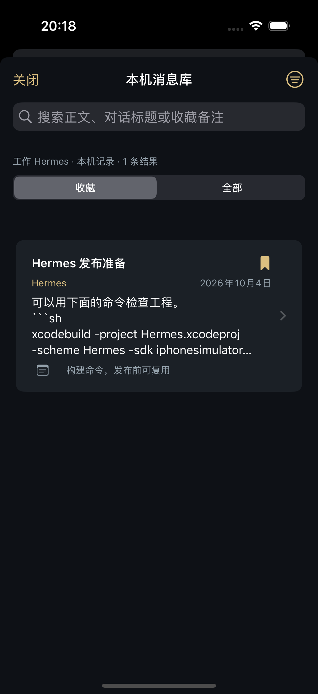
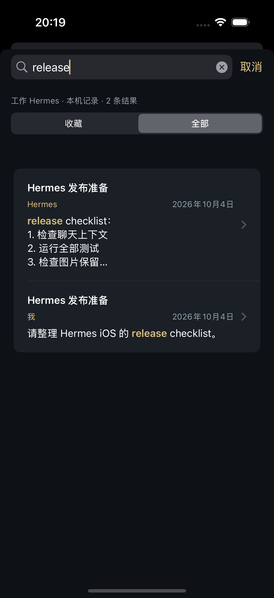
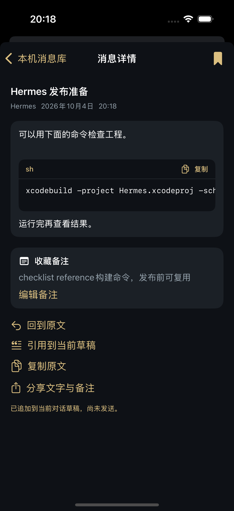


下图使用示例记录和模拟 API，展示代码复制、消息正文查找及修改旧问题的分支确认。

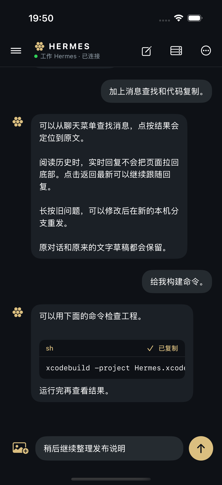
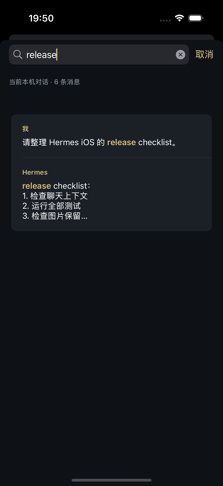
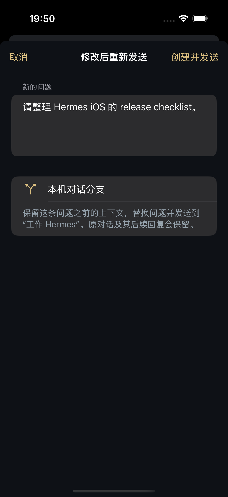


下图使用模拟 API 数据，展示服务端会话搜索、需关注任务筛选及任务详情。

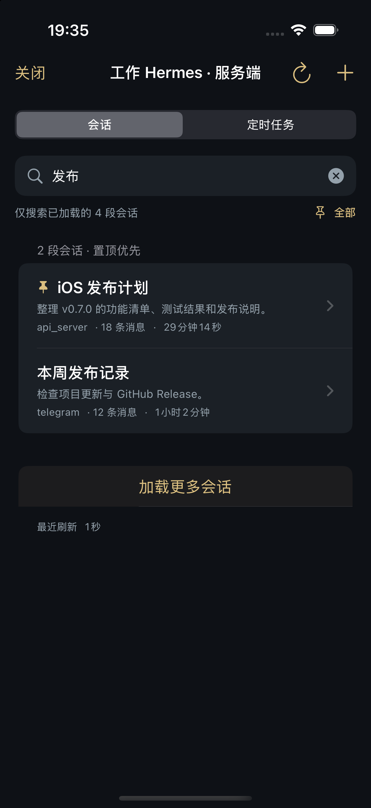
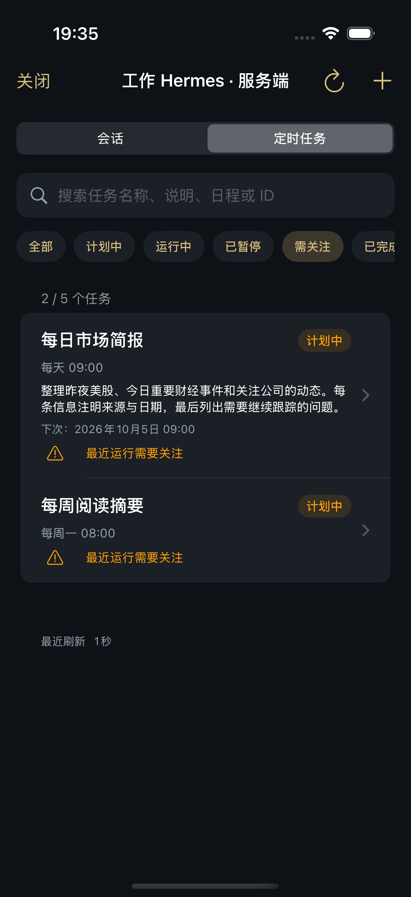
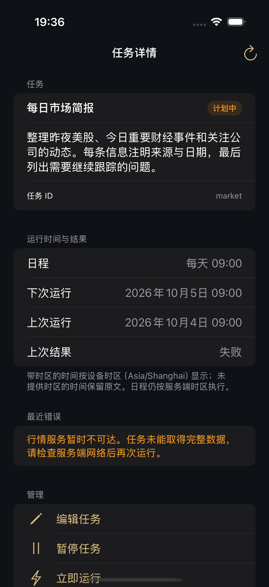

下图使用示例记录，展示备份导入确认与置顶对话界面。

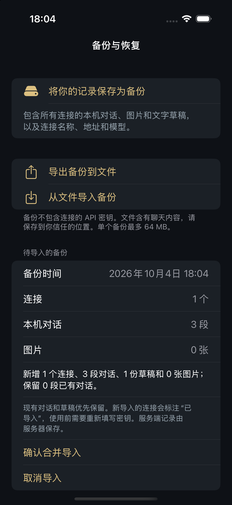
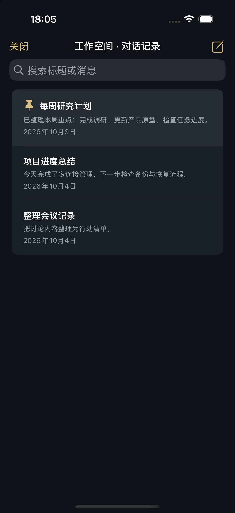

下图使用示例地址，展示多连接管理界面。

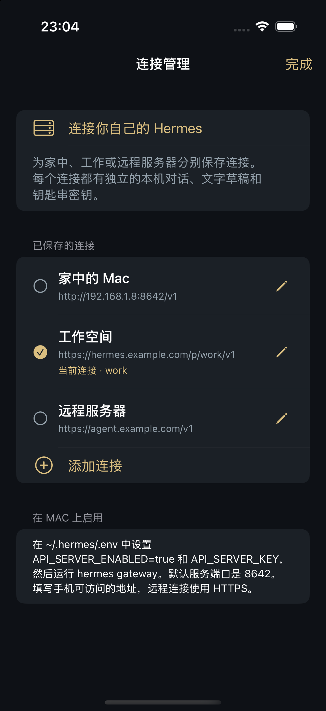

下图使用模拟会话和模拟审批数据，展示服务端续聊界面。

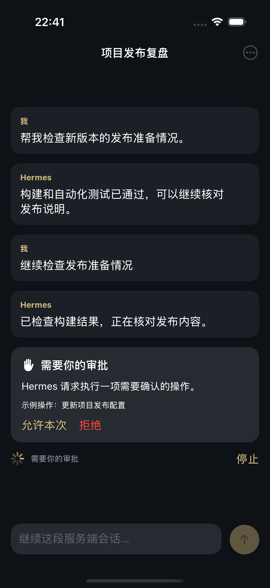

## 构建

```sh
xcodebuild -project Hermes.xcodeproj -scheme Hermes \
  -sdk iphonesimulator -destination 'generic/platform=iOS Simulator' \
  CODE_SIGNING_ALLOWED=NO build
```

工程文件可用 `ruby tools/generate_project.rb` 重新生成。脚本只纳入文件名符合常规 Swift 标识符的源码，跳过带空格的同步副本。图标可用 `python3 tools/generate_icon.py Hermes/Assets.xcassets/AppIcon.appiconset/AppIcon.png` 重新生成。

84 项测试覆盖消息库筛选、连接隔离、收藏备注、引用草稿、原文导航、备份格式兼容与中断恢复、保存失败、请求排除备注，以及原有分支、图片、工作区与流式接口功能，可在 Xcode 的 `HermesTests` scheme 中运行。

v0.9.0 已在 iPhone 16 Pro（iOS 18.1）模拟器通过 84 项测试、Release 构建与启动检查。独立临时预览工程的 4 条界面自动化流程通过，使用隔离的模拟 API 数据检查收藏备注、跨对话搜索定位、引用与草稿保留，以及服务端查找和流式回复期间的阅读位置；预览工程不包含在本仓库。本次未进行真实 Hermes API Server 的端到端测试，也未进行真机“文件”App 的备份往返测试。

API 格式依据 [Hermes Agent 官方 API Server 文档](https://hermes-agent.nousresearch.com/docs/user-guide/features/api-server)。
